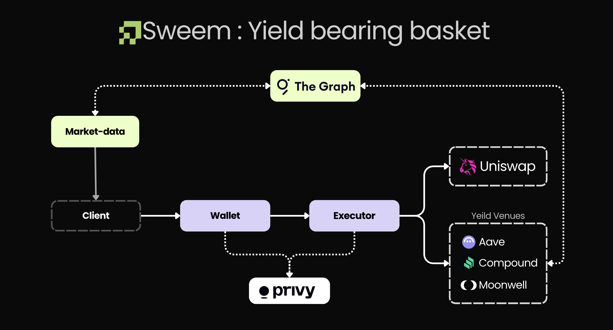

# sweem

A non-custodial yield router on Base. You deposit USDC, pick the assets you want,
and each slice is routed to the highest-yielding venue for that asset — then
moved again when the rates move.

**Funds never leave your own wallet.** There is no pooled vault, no shares, no
NAV. A basket is a published weight config. Subscribing makes *your* Privy
embedded wallet follow those weights, executed by a delegated signer that can
only call addresses on a committed allowlist. Delegation is revocable from the
navbar, and revoking it means only you can transact again.

ETHOnline 2026 submission. Repo: <https://github.com/snehendu098/sweem-basket>

---

## Why it exists

The same dollar of USDC on Base earns a different rate depending on which
contract holds it, and the spread is not small or stable. A snapshot from our
own mainnet subgraph, live as of writing:

```
Base:aave-v3:0x4200…0006   WETH    1.78%
Base:aave-v3:0x2ae3…ec22   cbETH   0.0002%
Base:aave-v3:0x2416…eea5   ezETH   0%
```

Nobody watches that. Existing answers are either a vault that takes custody and
issues you a share token, or a dashboard that tells you to go move the money
yourself. sweem is the third option: the money stays in your wallet, and
something else does the watching.

Two design consequences follow from "no custody", and they shape everything:

- The executor can only *move* funds, never *hold* them. Every destination in
  every transaction it builds is either an allowlisted venue or the user's own
  address.
- There is no accounting to get wrong. What the user owns is what their wallet
  holds, which is why the portfolio endpoint reconciles our database against
  onchain balances rather than treating the database as truth.

---

## Architecture



Signing authority lives in exactly one process. The keeper can be crashed,
restarted or duplicated without putting funds at risk, because its decision is
a *trigger*, not an authorization — the wallet service re-checks delegation,
drift and every guard before it calls the executor.

---

## The three tracks

### The Graph — Best Use of Composable/Standardized Products

**Two Graph products, plus a normalized schema that is the deliverable.**

1. **Subgraphs** — `subgraph/sweem/`, ours, deployed to Base mainnet and Base
   Sepolia. One manifest indexes **Aave V3, Compound III (Comet) and MetaMorpho
   (Morpho Blue)** and normalizes all three into a single `Venue` entity.
2. **Token API** — `services/wallet/internal/tokenapi/client.go`. The portfolio
   endpoint asks The Graph what the wallet actually holds on Base and reconciles
   it against our own `positions` rows. A position that disagrees reports
   `reconciled: false` with a reason; it is never quietly trusted.
3. **The decentralized network gateway** — third-party public subgraphs are
   queried through it for protocols we do not index ourselves (Moonwell,
   `33ex1ExmYQtwGVwri1AP3oMFPGSce6YbocBP7fWbsBrg`), and as a mainnet fallback
   while ours syncs.

The leverage claim is concrete: **three protocols publish yield in three
incompatible units, and none of them is an APY.**

| protocol | what it publishes | conversion, in the mapping |
|---|---|---|
| Aave V3 | `liquidityRate`, a ray (1e27) annual **simple** rate | `apr = rate/1e27`, then per-second compounding |
| Compound III | `getSupplyRate(getUtilization())`, a **per-second** factor scaled 1e18 — not per block | `apr = rate/1e18 * 31_536_000`, then compounding |
| MetaMorpho | **nothing at all** — no rate field exists | derived from ERC-4626 share-price growth between two hourly snapshots |

All three land on the same step, `expm1(n · log1p(r))` rather than `(1+r)^n`,
because at a per-second `r` of ~1e-9 the `1 + r` discards most of `r`'s
significant digits in f64. The Morpho share price is scaled 1e36, not 1e18,
because MetaMorpho shares carry a `DECIMALS_OFFSET()` of 12 on USDC vaults —
1e18 leaves about six significant digits and rounds an hour of yield away.
`mwETH` has an offset of 0, which is how we know the scale is not optional.

The result is that `venues` answers with Aave, Compound and Morpho side by side,
already comparable:

```graphql
{ venues(first: 5, orderBy: supplyApy, orderDirection: desc) {
    id protocol assetSymbol supplyApy totalSupply isActive } }
```

Deployed, live, not mocked:

```
Base mainnet   https://api.studio.thegraph.com/query/1759980/sweem-base/v0.0.5
Base Sepolia   https://api.studio.thegraph.com/query/1759980/sweem-base-sepolia/v0.0.1
```

At the time of writing mainnet returns 31 venues (15 aave-v3, 9 morpho-blue,
5 hold, 2 compound-v3) and Sepolia returns 15.

**Why the normalization is in the mappings and not in Go.** Doing it in Go on
top of three subgraphs makes the comparability a property of our service —
useful to us, useful to nobody else. Doing it in the mapping makes the schema
the artifact: anyone can query `venues` and get three protocols compounded
identically, without running any of our code. `services/market-data/internal/source/apy.go`
mirrors the same math, and `bun run check` in `subgraph/sweem/` pins the two
against each other so a divergence is a failing check rather than a wrong route.

`supplyApy: 0` means *no trustworthy rate yet*. It never means "0%, route here".

Read: `subgraph/README.md`, `subgraph/sweem/src/normalize.ts`,
`subgraph/sweem/schema.graphql`.

### Privy — Best Financial Flow

**Privy is the wallet layer, the auth layer and the signing layer. There is no
other key material in this system.**

| requirement | where |
|---|---|
| wallet created/used | Privy embedded wallet, created in `client/src/lib/session.tsx`; every transaction is sent from it |
| a Privy control | **delegated signers** + a **key quorum** (`NEXT_PUBLIC_PRIVY_SIGNER_ID`), added via `useSigners().addSigners` and removable via `removeSigners` |
| complete flow | deposit USDC → routed to the best venue → withdraw, end to end |
| working demo | two confirmed Base Sepolia transactions, below |

Delegation is the whole product. The user calls `addSigners` with the key quorum
that wraps the executor's authorization public key. From then on the executor can
sign for that wallet — and only by producing a valid ECDSA P-256 signature over
an RFC 8785 (JCS) canonicalization of the exact request:

```json
{"body":{…},"headers":{"privy-app-id":"…"},"method":"POST","url":"https://api.privy.io/v1/wallets/<id>/rpc","version":1}
```

Implemented from scratch in Rust (`executor/src/auth.rs`), because the executor
is not a Node process. Two details cost us real time and are pinned in tests:
an empty object body canonicalizes to the empty string `""`, not `{}`, and the
signature is DER-encoded standard base64, not raw `r||s` base64url. The
implementation was checked byte-identical against `@privy-io/node@0.34.0`'s own
`generateAuthorizationSignature`; `matches_privy_sdk_golden_vectors` pins
signatures generated by that SDK, so a serialization regression fails
`cargo test` rather than production.

Two properties that make the delegation safe to grant:

- **The executor holds no funds, ever.** It builds calldata and asks Privy to
  sign it from the user's wallet. Its own process has no wallet.
- **`to` never comes from the request.** The request names a venue *id*; the
  address is resolved from the committed `executor/venues.json`. A compromised
  caller — or a compromised indexer — cannot make the executor call an arbitrary
  contract, because the set of callable addresses is not on the request path.
  This is also why the allowlist is generated at build time and committed, not
  fetched at runtime.
- Withdrawals and redemptions pay out to the owner's address only
  (`withdraw_pays_out_to_the_owner`), and approvals target the asset contract
  while deposits target the venue (`approve_targets_the_asset_not_the_vault`).

Revocation is one button. `removeSigners` strips every signer from the wallet
and the wallet service's `/v1/me` immediately reports `delegated: false`, at
which point `/deposit` and `/rebalance` return `412` naming the missing
precondition.

Read: `executor/src/auth.rs`, `executor/src/privy.rs`, `client/src/lib/session.tsx`,
`services/wallet/internal/auth/privy.go`.

### Uniswap Foundation — Best Uniswap Stack Contribution

- Public repo: <https://github.com/snehendu098/sweem-basket>
- **[`FEEDBACK.md`](./FEEDBACK.md)** — written from the integration, not after it.
- Developer Feedback Form: see `FEEDBACK.md` for the written feedback.

**What to look at:**

| file | what it contains |
|---|---|
| [`executor/src/swaps.rs`](./executor/src/swaps.rs) | `sol!` bindings for SwapRouter02 and QuoterV2, path packing, quoting, slippage clamp |
| [`executor/swaps.json`](./executor/swaps.json) | the static path allowlist — 8 paths, 4 pairs in and out |
| [`executor/src/route.rs`](./executor/src/route.rs) | `swap_deposit` / hold-exit: where the swap leg is sequenced |

Verified addresses, Base mainnet (8453):

```
SwapRouter02  0x2626664c2603336E57B271c5C0b26F421741e481
QuoterV2      0x3d4e44Eb1374240CE5F1B871ab261CD16335B76a
```

A deposit into a non-USDC asset becomes
`approve(router) → swap → approve(venue) → supply`, with the user's own wallet
as `recipient` on the swap — the output never lands in a contract we control.

Two things we would call the actual contribution:

**A swap is never submitted without a live quote.** `amountOutMinimum` is always
`quoted * (10_000 - slippage_bps) / 10_000`, never 0; the caller's
`max_slippage_bps` is clamped server-side to 10..=300 with a 50bps default, so a
caller cannot widen its own loss bound. An unreachable QuoterV2 fails the leg.

**The direct pools are a trap.** We measured price impact at two sizes before
trusting any path, and the obvious single-hop routes are catastrophic:

| path | $100 | $1,000 |
|---|---|---|
| USDC→wstETH direct (500) | −3.23% | **−78.4%** |
| USDC→cbETH direct (3000) | −1.79% | −15.5% |
| USDC-500-WETH-100-wstETH | −0.0003% | −0.0033% |
| USDC-500-WETH-500-cbETH | −0.0007% | −0.0073% |

Nothing in the contract interface distinguishes a deep pool from a dead one with
the same fee tier. That finding, and three others (the `exactInput` calldata
offset, the QuoterV2 non-`view` warning reading worse than it is, and
`sqrtPriceLimitX96` silently partial-filling), are written up in `FEEDBACK.md`.

Every entry path in `swaps.json` has its exit. A hold venue you can enter and
cannot leave is worse than no venue.

---

## What is deployed

| thing | where |
|---|---|
| sweem subgraph, Base mainnet | `https://api.studio.thegraph.com/query/1759980/sweem-base/v0.0.5` |
| sweem subgraph, Base Sepolia | `https://api.studio.thegraph.com/query/1759980/sweem-base-sepolia/v0.0.1` |
| executor allowlist | `executor/venues.json` — 33 venues on Base mainnet, 4 on Base Sepolia |
| swap allowlist | `executor/swaps.json` — 8 paths, Base mainnet only |
| Privy key quorum | registered; the signer id the client adds on delegate |

We deploy no contracts of our own. Every address this system touches is a
protocol that already existed.

The allowlist is generated, not hand-written:

```sh
go run ./services/market-data/cmd/gen-venues -out executor/venues.json
go run ./services/market-data/cmd/gen-venues -dry-run     # print, write nothing
```

A venue is emitted only if it is encodable (maps to a `VenueKind` the executor
implements), priceable (a verified Chainlink feed for the underlying on that
chain), liquid (clears the TVL floor), and verified on chain — `symbol()`,
`decimals()`, plus a protocol identity check (`getReservesList()`, `baseToken()`,
`asset()`, `isMToken()`). Everything else is skipped with a printed reason.

---

## Running it locally

```sh
cp .env.example .env     # fill in the values below
docker compose up --build
cd client && bun install && bun dev     # http://localhost:3000
```

| service | port | notes |
|---|---|---|
| postgres | 5432 | wallet-service database |
| redis | 6379 | venue cache + `venues:updated` pubsub |
| market-data (api) | 8081 | `/venues`, `/venues/best`, `/assets`, `/sources` |
| wallet | 8080 | the only client of the executor |
| executor | 8082 | the only thing that signs |
| keeper | 8083 | `/health` reports every skip reason |
| client | 3000 | **not containerised on purpose** — Next rebuilds per change |

Required before the first run: `PRIVY_APP_ID`, `PRIVY_APP_SECRET`,
`PRIVY_AUTHORIZATION_PRIVATE_KEY`, `GRAPH_API_KEY`, `BASE_RPC_URL_8453`,
`BASE_RPC_URL_84532`, and the client's `NEXT_PUBLIC_PRIVY_APP_ID` /
`NEXT_PUBLIC_PRIVY_SIGNER_ID`. `TOKEN_API_JWT` is optional — without it the
portfolio answers with `onchain_available: false` rather than failing.

Everything is fail-closed at boot. The wallet service refuses to start if it
cannot fetch its Privy verification key; the executor refuses to start with a
missing, unparseable or *empty* allowlist; the keeper forces dry-run without
`KEEPER_SECRET`. See `README.docker.md`.

Tests, none of which need a network:

```sh
go test ./...                          # wallet, market-data, keeper
cd executor && cargo test
cd subgraph/sweem && bun run check     # subgraph rate math == apy.go
```

---

## Proof it works

Base Sepolia, both confirmed, both sent **from the user's own embedded wallet**
`0x0e5cC5C5c14e89a4DaFf87ea314C25EF37c8C08f` — not from any wallet this service
controls:

| | tx | outcome |
|---|---|---|
| deposit | [`0x06f2f60e615e475f67f10ce882434056c8e4d4342e8bae57e48fe809fe2e6f63`](https://sepolia.basescan.org/tx/0x06f2f60e615e475f67f10ce882434056c8e4d4342e8bae57e48fe809fe2e6f63) | $5 USDC → Aave V3, block 46,737,948 |
| withdraw | [`0x0ed990f571044dc556afeb630a3b63ad9fcbc7d2c295dbc6e6d29fbb4ba2d68d`](https://sepolia.basescan.org/tx/0x0ed990f571044dc556afeb630a3b63ad9fcbc7d2c295dbc6e6d29fbb4ba2d68d) | $5 back out, block 46,738,982 |

Both landed on the Aave V3 Pool at `0x07eA79F68B2B3df564D0A34F8e19D9B1e339814b`,
which is the same address `subgraph/sweem/networks.json` indexes and the same
`target` in the `base-sepolia:aave-v3:…` entries of `executor/venues.json`. The
round trip — deposit, earn, withdraw — is closed. A product you can enter and
cannot leave is not a product.

---

## Repo layout

```
subgraph/sweem/            one subgraph: Aave V3 + Compound III + MetaMorpho
  src/normalize.ts           three rate conventions -> one supplyApy
  src/{aave,comet,morpho-vault,morpho-factory,rate-feeds}.ts
  schema.graphql             the normalized Venue entity
services/market-data/      Go :8081 — where is the best yield for asset X?
  internal/source/           one adapter per protocol; subgraph + direct eth_call,
                             reconciled per APY component
  cmd/publisher              polls, normalizes, rewrites Redis
  cmd/gen-venues             generates executor/venues.json
services/wallet/           Go :8080 — auth, baskets, plan/deposit/withdraw/rebalance
  internal/api/              handlers; per-leg partial failure is a first-class outcome
  internal/tokenapi/         The Graph Token API — onchain balances
services/keeper/           Go :8083 — decides when to rebalance
  internal/policy/           pure: breakeven, hysteresis, rate limit, reward discount
  internal/gas/              live gas price + Chainlink ETH/USD; no configured guesses
executor/                  Rust :8082 — the only thing that signs
  src/venues.rs              allowlist + ABI encoding. The security boundary.
  src/route.rs               validation and submission sequencing
  src/swaps.rs               Uniswap v3 SwapRouter02 + QuoterV2
  src/auth.rs                Privy P-256 authorization signatures
  venues.json / swaps.json   the two allowlists, generated and committed
internal/shared/prices/     Chainlink client, shared by wallet and market-data
client/                    Next.js :3000
FEEDBACK.md                Uniswap integration feedback
README.docker.md           running the whole stack
```

---

## What is not done

This is the honest list. None of it is hidden elsewhere in the repo.

- **Rebalance has never executed.** The keeper's policy is built and unit-tested
  (`services/keeper/internal/policy/`), the wallet service's `/rebalance` route
  exists, the executor's three-call rebalance sequence exists and is tested. No
  rebalance has ever run against a live position. Every part of the path has been
  exercised; the path as a whole has not.
- **Swaps are quoted live and never submitted.** `swaps.json` contains mainnet
  paths only, and mainnet has never run a transaction — so the swap leg has been
  quoted against real pools many times and has never been signed. The price
  impact table above is measurement, not execution.
- **Mainnet has 33 allowlisted venues and zero transactions.** Everything on
  8453 is read-only so far: rates indexed, prices read, quotes taken, allowlist
  generated and verified on chain. No money has moved there.
- **The Privy policy exists and is verified, but is not retrofitted onto
  existing delegations.** Policy `z1x25a74qs5slp2bd0srk3sy` is generated from
  `executor/venues.json` and `executor/swaps.json` by
  `go run ./services/wallet/cmd/sync-policy`, so regenerating the allowlist and
  re-running keeps Privy in sync. It pins the callable addresses, the methods
  allowed per venue kind, the chain ids, and — the rule that matters most —
  constrains `approve.spender` to allowlisted targets, since an unconstrained
  `approve` is how funds actually leave a wallet. Native value transfers are
  denied outright.

  Enforcement was measured, not assumed: nine probes against a throwaway wallet
  using `eth_signTransaction` (which signs without broadcasting, so nothing was
  spent). Allowed calls signed; an `approve` to an unlisted spender, a transfer
  to an unlisted address, a wrong chain id, a non-zero value and `personal_sign`
  all returned `policy_violation`.

  What is *not* done: a signer delegated before the policy id was set keeps an
  unconstrained override. Privy evaluates the acting signer's own policy, so
  those users must revoke and re-delegate to pick it up. Until they do, the
  local allowlist remains the only constraint for them — enforced in our
  process, not in Privy's. `eth_sendTransaction` was also never exercised
  against the policy, because it broadcasts and needs funds; its rules are
  byte-identical to the `eth_signTransaction` ones that passed, which is an
  inference rather than a measurement.
- **Base Sepolia has two assets, USDC and WETH.** That is all that exists there —
  four venues total across Aave V3 and Compound III. The demo is small because
  the testnet is small, not because the router is.
- **Nothing sweeps stuck executions in the wallet service itself.** A leg whose
  receipt poll times out is recorded `pending` with its tx hash and stays that
  way until the keeper's sweeper resolves it. If the keeper is not running, it
  stays `pending` indefinitely.
- **Non-USD assets cannot be withdrawn or rebalanced.** Sizing a USD figure into
  an amount of WETH on the way *out* is not implemented; only the way in is.
- **Moonwell rates are known to be overstated.** The Messari subgraph folds WELL
  emissions into a single LENDER rate, so `apy_reward` reads 0 and `apy_base` is
  inflated — that venue dodges the keeper's reward discount entirely. Fixing it
  means splitting the rate at the source.
- **The keeper's gas figure is an approximation.** It cannot `eth_estimateGas`
  the exact transaction because the executor builds the calldata, so it uses
  measured constants at the top of the observed range, and does not price Base's
  L1 data-availability fee. `SAFETY_MARGIN` absorbs the difference.

---

## Three choices worth one line each

**The executor resolves venue addresses from a committed local file, not from
the request.** The request names a venue *id*; the address comes from
`venues.json`. That makes the set of contracts the delegated signer can call
independent of the request path, so a compromised caller or a compromised
indexer cannot redirect a transaction.

**Rates are normalized inside the subgraph mappings, not in Go.** In Go it would
be a property of our service; in the mapping it is a property of the schema, so
anyone can query three protocols already compounded the same way without running
our code.

**A failed price read renders "value unknown", never a default.** No feed, a
stale round or an unreachable node means `price_usd: null` and a stated reason —
the leg is skipped rather than routed. A fabricated $1 misroutes money exactly as
badly as a fabricated APY, and it does it silently.
